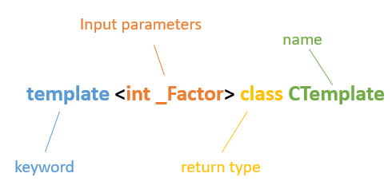

Template Basics
===============
Preface
-------
The progression of modern C++ can be described as evolving through two distinct paradigms. First from the legacy C to object-oriented C++ with classes. The modern paradigm can be described as a shift toward [Template Meta Programming](https://en.wikipedia.org/wiki/Template_metaprogramming).

Meta-Programming differs from conventional programming in a number of ways.  A prominent distinction is that meta-programming is more accurately programming the compiler how and what to compile rather than programming a processor what to execute. Meta-programming closely interacts with the compiler typically before machine code is generated. It is close interaction with the compiler that makes meta-programming the preferential platform of generic library developers.

> It's worth noting that I make a distinction between generic and object-oriented. In this context, generic programming may or may not be OO while OO is not generic. OO refers to concrete or abstract class types while generic programming is more or less type-less.

The C++ template engine is a [Turing Complete](https://en.wikipedia.org/wiki/Turing_completeness) "language" within C++ that continues to grow and yield powerful new language extensions with each adopted revision of the language standard. Because the features were an after-thought and more or less discovered by accident, the syntax is cumbersome, unfamiliar and non-intuitive. It requires significant dedication to navigate the plethora of caveats but the payoffs can be significant.

The goal of this informative is to shed light on the C++ template engine and present the topic in an easy to understand format with descriptive examples, each step building on the prior. This work will by no means be a complete corpus on this lengthy topic. The intent is to be a spring-board by which some basic knowledge can be derived. See the 'Suggested Reading' section at the bottom of this page for more detailed information. 

Template Basics
---------------
At it's most basic level, templates permit a generic or type-less algorithm to work with various concrete types. When a template is used the compiler will qualify the generic types into the concrete types required to run. For example, here's a simple function template:
~~~{.c}
template <typename _Ty> _Ty square(_Ty src){ return src * src; }
~~~
This function template can be reused to square shorts, ints, longs, doubles or any other type that supports operator *.  The compiler will substitute the `_Ty` parameter with other concrete types at compile time to _generate_ the various overloaded versions of the function. Consider the following usage scenarios:

~~~{.c}
char cVal = 8;
int iVal = 123;
double dVal = 3.14;

std::cout << square<char>(cVal) << std::endl;
std::cout << square<int>(iVal) << std::endl;
std::cout << square<double>(dVal) << std::endl;
~~~

The compiler will substitute the generic _Ty parameter with a char, int and double respectively to generate the following specializations:

~~~{.c}
char square(char src){ return src * src; }
int square(int src){ return src * src; }
double square(double src){ return src * src; }
~~~
The above three *specializaitons* are generated by the compiler based on the usage scenarios despite the single instance of the `square` function template in code. This feature can obviously save a lot of typing and technical debit when a single definition needs maintaining instead of three. The notable take-away from TMP at this point is **code generation**.

The above specializations are qualified with the type surrounded in angle brackets. (e.g. square<**char**>) Function templates have a special ability to evaluate certain parameter types based on usage scenarios. The above template can be simplified:
~~~{.c}
template <typename _Ty> auto square(_Ty src) -> _Ty { return src * src; }
~~~
In this example, the `auto` keyword is a placeholder ordering the compiler to evaluate the type at a later time.  This new version of `square` can be used without the type qualifiers:
~~~{.c}
char cVal = 8;
int iVal = 123;
double dVal = 3.14;

std::cout << square(cVal) << std::endl;
std::cout << square(iVal) << std::endl;
std::cout << square(dVal) << std::endl;
~~~
Here the types are unambiguous because they can be deduced based on the usage scenario so there's no need to qualify them. If the type cannot be deduced based on the usage scenario it must be qualified in the template parameter list. Within the definition of the specialization the parameters must be listed in the order that they're declared.
### Class Templates
The previous examples demonstrate _function templates_. _Class templates_ are another template variation:
~~~{.c}
template <typename _Ty> struct CheckedPointer{
    CheckedPointer(_Ty * newval) : _Ptr(newval){}
    _Ty * operator->() { assert(_Ptr); return _Ptr; }
    void delete_it(){
        delete _Ptr;
        _Ptr = nullptr;
    }
    _Ty * _Ptr;
};
~~~
This is a very simple class template that checks if the contained pointer to type _Ty is not null during every access. This template could be used in code like:
~~~{.c}
int main(){
    struct user{
        int userid;
        int lastlogin;
    };
    CheckedPointer<user> oUser(new user);
    oUser->userid = 1234;
    oUser->delete_it();
    oUser->lastlogin = 111980; //assert
}
~~~
### Type and Non-Type Parameters
Templates can accept type and non-type parameters. Type parameters refer to all the compiler intrinsic and user defined types such as classes and structures. Compiler intrinsics are identified with keywords such as `int`, `short`, `double`, etc.  Non-type parameters included values that can be evaluated at compile time such as static constant pointers and references.

Here's an example of a class template that accepts a type and non-type template parameters:
~~~{.c}
template <typename _Ty, size_t _Dims> struct StaticArray{
    _Ty value[_Dims];
};
~~~
This very simply declares a fixed sized array. It's of little use but can be used in code as:
~~~{.c}
int main(){
    StaticArray<int, 10> oArr;
    oArr.value[0] = 123;
    return oArr.value[0];
}
~~~
The first parameter is a type parameter, the second is a non-type parameter. Here's another example that pre-computes a value:
~~~{.c}
template <typename _Ty, size_t _Dims> struct StaticArray{
    static const bool EvenNumberOfElements = (0 == ( _Dims %2 ));
    ...
};
~~~
Here the template engine performs the division and comparison at compile time and stores the result in the static constant. This consumes no clock cycles at run-time to calculate. Integral types can be calculated with ease by the template engine and leveraged in various ways to achieve significant run-time performance improvements. This is the name of the game with TMP: interacting with the compiler to generate, pre-compute and pre-compile as much as possible to reduce run-time overhead and reduce the volume of maintainable code. 
Specialization
--------------
The generic form of a function template is declared with the following convention:

[]

A class template is almost identical:

[]

The input parameters on the generic form appear on the left-hand-side of the template name.

A class or function template is specialized when a generic parameter is explicitly qualified in a declaration. For example, assume a compile-time constant is calculated:
~~~{.c}
template <int _Factor> int Factoral(){
  return _Factor * Factoral<_Factor - 1>();
}
~~~
This is a function template that calculates `value` at compile time by recursively multiplying the value of the `_Factor` parameter by `_Factor-1`. At first glance this may seem correct, however, there's at least two problems with it. First, at some point during the recursive calculation the value of _Factor will reach zero and invalidate the computation (anything multiplied by zero is zero). Next, there is no terminating condition for the recursive calls so the compile will fail at some point due to infinite recursion. For this function to operate as expected a specialization is introduced that terminates the recursion and corrects the calculation:
~~~{.c}
template <> int Factoral<1>(){
  return 1;
}
~~~
The fully specialized form of a function template is declared with the following convention:

[]

And a class template is almost identical:

[]

Notice the specialized values appear on the right-hand-side of the template name.  This distinguishes specialized templates from their generic form. Input parameters appear to the left of the name while output parameters appear to the right.

During compilation, the compiler chooses the _most specialized_ version of a template over a lesser specialized version whenever multiple are encountered. In this case, the specialized  `template <> struct Factoral<1>` is more specialized than the generic `template <size_t _Factor> struct Factoral` so the compiler chooses it while recursively calculating the value. Assume this function template is used as:
~~~{.c}
int main(){
  return Factoral<5>();
}
~~~
The compiler generate 4 specializations before instantiating the explicit Factoral<1> specialization. Here is an excerpt of the listing file generated by MSVC14 with debugging enabled:
~~~{.asm}
PUBLIC	??$Factoral@$04@@YAHXZ				; Factoral<5>
PUBLIC	??$Factoral@$03@@YAHXZ				; Factoral<4>
PUBLIC	??$Factoral@$02@@YAHXZ				; Factoral<3>
PUBLIC	??$Factoral@$01@@YAHXZ				; Factoral<2>
PUBLIC	??$Factoral@$00@@YAHXZ				; Factoral<1>
~~~
`Factoral<5>` through `Factoral<2>` are compiler generated specializations that will be called in the expected order. The beauty of TMP can be demonstrated in the listing of the release build. Since the values are deterministic at compile-time, the optimizer eliminates it all:
~~~{.c}
; int main() {
; return Factoral<5>();
00E11000  mov         eax,78h  
00E11005  ret  
~~~

The only run-time code that is generated is to return the result of the compile-time calculation. None of the heavy lifting is done at run-time so we get excellent performance gains. Today's optimizers are very complex and to leverage their full potential, template meta-programs perform as much compile-time computation as possible.

Partial Specialization
----------------------
When a template is fully specialized, all the output parameters are explicitly specified to fully qualify the generic form's input parameters. Partial specialization, as the name implies, specialize only a portion of the output parameters while others may be implicitly deducible by the compiler. This permits a specialized template to have a specific set of behaviors for a target group of instances while other instances may have different behaviors.

Partial specializations have the following form:

[]

The output parameters of specializations must match the order of inputs on the generic form but the input parameters don't have to.

Here's an example of partial specialization:
~~~{.cpp}
struct Widget{
  static const int Cost = 3;
};
struct Snafoo{
  static const int Cost = 5;
};
struct Fizzbang{
  static const int Cost = 7;
};
template <typename _Ty, int _Quantity> struct Order{
  static const int Total = _Ty::Cost * _Quantity;
};
template <typename _Ty> struct Order<_Ty, 10>{
  static const int Total = _Ty::Cost * 10 - 5;
};
int main(int argc, char * argv[]){
  std::cout << "Order<Widget, 5>::Total : " << Order<Widget, 5>::Total << std::endl;
  std::cout << "Order<Snafoo, 5>::Total : " << Order<Snafoo, 5>::Total << std::endl;
  std::cout << "Order<Fizzbang, 5>::Total : " << Order<Fizzbang, 5>::Total << std::endl;
  std::cout << "Order<Widget, 10>::Total : " << Order<Widget, 10>::Total << std::endl;
  std::cout << "Order<Snafoo, 10>::Total : " << Order<Snafoo, 10>::Total << std::endl;
  std::cout << "Order<Fizzbang, 10>::Total : " << Order<Fizzbang, 10>::Total << std::endl;
  return oConfig.Total;
}
~~~
This app calculates the total cost of an order. The partial specialization produces a $5 discount when 10 items are ordered. The first three outputs are:
~~~
Order<Widget, 5>::Total : 15
Order<Snafoo, 5>::Total : 25
Order<Fizzbang, 5>::Total : 35
~~~
The last three outputs are:
~~~
Order<Widget, 10>::Total : 25
Order<Snafoo, 10>::Total : 45
Order<Fizzbang, 10>::Total : 65
~~~
During the type deduction phase, the compiler chooses the _most specialized_ variation of a template to instantiate and expand. Order<Widget, 10>, Order<Snafoo, 10> and Order<Fizzbang, 10> match both form of the Order templates but the partial specialization is _more specialized_ than the generic form so the compiler chooses it to instantiate during type deduction.

Suggested Reading
-----------------    

 * [Advanced Metaprogramming in Classic C++](https://www.amazon.com/Advanced-Metaprogramming-Classic-Davide-Gennaro/dp/1484210115) 
 * [C++ Templates: The Complete Guide](https://www.amazon.com/Templates-Complete-Guide-David-Vandevoorde/dp/0201734842)
 * [C++ Template Metaprogramming: Concepts, Tools, and Techniques from Boost and Beyond](https://www.amazon.com/Template-Metaprogramming-Concepts-Techniques-Beyond/dp/0321227255)
 * [Effective Modern C++: 42 Specific Ways to Improve Your Use of C++11 and C++14](https://www.amazon.com/Effective-Modern-Specific-Ways-Improve/dp/1491903996)
 * [Modern C++ Design: Generic Programming and Design Patterns Applied](https://www.amazon.com/Modern-Design-Generic-Programming-Patterns/dp/0201704315)

Copyright :copyright: David Mott 2016  

